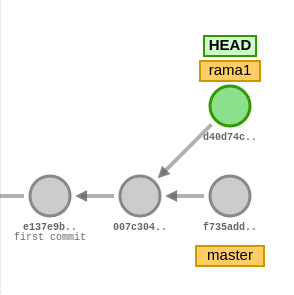

# Trabajar con Ramas
{: .no_toc }

<details open markdown="block">
  <summary>
    Tabla de contenidos
  </summary>
  {: .text-delta }
- TOC
{:toc}
</details>

## 1. Ramas

### Definición de ramas

- Una rama es un puntero que apunta a un determinado commit.
- Un repositorio debe tener una rama como mínimo.
- El nombre de la rama que se crea por defecto es `master`. Este nombre no es especial ni tiene una función o significado especial. En *GitHub* la rama que se crea por defecto si se inicializa un repositorio a través de su interfaz web (lo veremos en la sesión siguiente) se llama `main`.
- Existe un puntero especial llamado `HEAD` que apunta a la rama en la que estamos en ese momento.
- Al cambiar de rama se modifica el contenido del directorio de trabajo: éste se muestra tal como estaba en la rama a la que hemos saltado.
- El trabajo con ramas es muy interesante por los siguientes motivos:
   - Se pueden hacer pruebas sin modificar el código en producción.
   - Se puede separar el trabajo en tareas o subproyectos que no afecten unos a otros.
   - Cada miembro del equipo puede trabajar sin ser interferido por los demás.


### Crear ramas

Para crear una rama tenemos 2 opciones. La primera más sencilla es utilizar el siguiente comando:
```bash
git branch <nombre_rama>
```

Con ese comando se crea una rama a partir del último commit realizado (es decir, donde se encuentra el puntero `HEAD`) y **no nos cambia el puntero de posición**, es decir `HEAD` continuará apuntando a la rama *master* y no a la nueva rama creada.

La alternativa es crear una nueva rama con el comando siguiente:
```bash
git checkout -b <nombre_rama>
```

Con este comando se crea la nueva rama, pero además el puntero `HEAD` se posiciona en la nueva rama creada.

### Ver ramas disponibles

```bash
git branch
```

El asterisco * indica dónde está posicionado el puntero `HEAD`, es decir, en qué commit estamos situados.

### Eliminar una rama

```bash
git branch -d <nombre_rama>
```

Este comando eliminará la rama local indicada. 

En el ejemplo siguiente, si se elimina la rama `test1` se perderán los commits `5aebbf7`, `897742a` y `6ba47e7`, ya que no habrá ninguna rama que haga referencia a ellos.


### Cambiar de rama
Para posicionarnos en otra rama (cambiar el puntero `HEAD`) utilizamos el comando que hemos visto al crear la rama y posiconarnos en ella:
```bash
git checkout <nombre_rama>
```
Es posible que el comando falle si hay cambios en el directorio de trabajo que no estén integrados en ningún commit.

---

## 2. Fusión de ramas

Fusionar una rama, en inglés merge, consiste en incorporar los cambios presentes en una rama a la rama en la que nos encontramos actualmente. Para realizar una fusión hay que realizar las siguientes acciones:

- Primero nos posicionamos en la rama sobre la que se va a realizar la fusión (la rama que va a recibir los cambios)
- Para realizar la fusión ejecutar:
```bash
   git merge <nombre_rama_a_fusionar>
```        

Si por ejemplo queremos integrar en la rama principal (`master`) los cambios presentes en la rama `feature1`, cambiaremos a la rama principal (si no estamos ya en ella) y a continuación ejecutaremos el merge:
```bash
git checkout master
git merge feature1
```

## 3. Conflictos

Al fusionar una rama pueden producirse conflictos. Un conflicto se produce cuando diferentes commits introducen cambios en las mismas líneas de los mismos archivos. Si por ejemplo estamos en un commit referenciado por dos ramas y realizamos desde ese punto común un commit en cada una de las ramas de manera que afecten a la misma línea del mismo fichero, se producirá un conflicto al fusionar una rama en la otra.

Por ejemplo, en esta imagen podría producirse un conflicto si queremos incorporar los cambios de la rama master en la rama `rama1` mediante `git merge master` (siempre que los cambios producidos en los commits afecten a las mismas líneas de los mismos ficheros).



Al producirse un conflicto, git no sabe qué cambios deben prevalecer: los de la rama A, los de la rama B, los dos, ninguno, algo totalmente distinto,… En este caso es necesaria la intervención humana. Git modificará los ficheros afectados incluyendo delimitadores para indicar los cambios que vienen de una rama y los que vienen de `HEAD`, es decir, de la rama en la que nos encontremos.

Es importante recalcar que git no perderá información: la incluirá toda, junto con los delimitadores para identificar la procedencia de los cambios.

Si se produce un conflicto git quedará en un estado intermedio: añadirá al área de preparación (color verde) los archivos que no presenten conflictos e indicará los archivos en conflicto, en color rojo, para que el usuario los edite y resuelva los conflictos.

Resolver los conflictos pasa por editar el archivo, localizar los delimitadores y dejar el archivo como queremos que quede. Normalmente esta última acción consistirá en decidir qué cambios son los que queremos dejar y eliminar los delimitadores. Al final, el fichero debe quedar tal como queremos que quede: en ocasiones una de las versiones será la correcta; en otras, la otra versión; en otras, ninguna; en obras, ambas; en otras, algo totalmente distinto.

Una vez resuelto el conflicto en todos los archivos habrá que ejecutar los comandos `git add` y `git commit` para crear un commit que resuelva el conflicto.

---

## 4. Práctica guiada
Comenzamos creando un directorio de trabajo y situándonos en él:
```bash
mkdir practica2
cd practica2
```

A continuación creamos un repositorio dentro del directorio de trabajo:
```bash
git init
```

Con un editor de texto creamos un fichero llamado `frutas.txt` e insertamos el siguiente contenido:
```
manzanas
peras
uva
```

Guardamos en el repositorio:
```bash
git add .
git commit -m "Commit inicial"
```

Vamos a realizar una segunda versión del fichero `frutas.txt` y añadimos una nueva línea al final del fichero:
```
naranjas
```

Guardamos en el repositorio:
```bash
git add .
git commit -m "Modificamos frutas para añadir naranjas"
```

Vamos a crear una nueva rama y nos situamos en ella:
```bash
git checkout -b "new-feature"
```

Creamos un nuevo fichero llamado `legumbres.txt` con el siguiente contenido:
```
garbanzos
lentejas
```

Lo añadimos al repositorio. Como estamos situados en la rama `new-feature` no afectará a la rama `master` (o `main`):
```bash
git add .
git commit -m "Nuevo fichero legumbres"
```

Vamos a realizar una segunda versión del fichero `legumbres.txt` y añadimos una nueva línea al final del fichero:
```
guisantes
```

Guardamos en el repositorio:
```bash
git add .
git commit -m "Modificamos legumbres para añadir guisantes"
```

Visualizamos el historial de cambios:
```bash
git log --oneline --all --graph
```

Vamos a situarnos en la rama `master` y a realizar un cambio.
```bash
git checkout master
```

Si visualizamos el contenido de nuestro directorio veremos que ha desaparecido el fichero `legumbres.txt`, puesto que estamos en la rama `master` y ese fichero sólo existe en la rama `new-feature`.
```bash
ls
```

Vamos a modificar el fichero `frutas.txt` para añadir una nueva línea:
```
plátanos
```

Guardamos en el repositorio:
```bash
git add .
git commit -m "Modificamos frutas para añadir plátanos"
```

Visualizamos el historial de cambios:
```bash
git log --oneline --all --graph
```

Nos aparecen las 2 ramas con sus cambios. Vamos a unir el contenido de la rama `new-feature` con la rama `master`. **IMPORTANTE: Es necesario estar situados en la rama en la que deseamos dejar los cambios**
```bash
git merge new-feature
```

Si realizamos un `ls` para visualizar el contenido de nuestro directorio de trabajo veremos que ya nos aparece el fichero `legumbres.txt`. Des mismo modo podemos ver el historial de commits en la rama `master`:
```
git log --oneline --graph
```

```
*   fe2f0ab (HEAD -> master) Merge branch 'new-feature'
|\
| * 3503286 (new-feature) Modificamos legumbres para añadir guisantes
| * 6f5937c Nuevo fichero legumbres
* | 2929c5c Modificamos frutas para añadir plátanos
|/
* d7fadfa Modificamos frutas para añadir naranjas
* 4378cea Commit inicial
```

Si hubiéramos realizado ningún cambio sobre el fichero `frutas.txt` en la rama `new-feature`, al hacer el merge habría una colisión con el cambio que se ha hecho en la rama `master` después de haber creado la rama `new-feature`, y correspondería al usuario resolver el conflicto de manera manual.

---

## 5. Práctica a realizar
Crea una carpeta denominada `Sesion2`. Realiza las siguientes acciones en ella:
- Crea un repositorio Git.
- Crea un fichero denominado `actores.txt`. Añade tres nombres de actores cada uno en una línea distinta.
- Haz un primer commit.
- Crea una rama denominada `test`.
- Cambia a la rama `test`
- En la rama `test` crea un fichero denominado `actrices.txt`. 
- Añade tres nombres de actrices y realiza un commit en dicha rama.
- Haz una captura de pantalla del resultado del comando `git log --graph --all`.
- Cambia a la rama `master`.
- Incorpora los cambios de la rama `test` a la rama `master`. Haz una captura de pantalla de los comandos que has utilizado y de su resultado.
- Crea una segunda rama denominada `test2`. La rama `test2` apunta al mismo commit que la rama `master` en este momento.
- En la rama `master`, añade una actriz al fichero `actrices.txt` y haz un commit.
- Cambia a la rama `test2`
- En la rama `test2`, añade una actriz al fichero `actrices.txt` y haz otro commit.
- Haz una captura de pantalla del resultado del comando `git log --graph --all`. Debe haber dos caminos distintos: uno para la rama `master` y otro para la rama `test2`.
- Cambia a la rama `master`
- Incorpora los cambios de la rama `test2` a la rama `master`. ¿Se produce un conflicto? De ser así realiza una captura del comando `git status`.
- Resuelve el conflicto incorporando los dos nombres de actrices.
- Haz una captura de pantalla del resultado del comando `git log --graph --all`. Observa que se ha creado un nuevo commit que integra los dos caminos anteriores.
